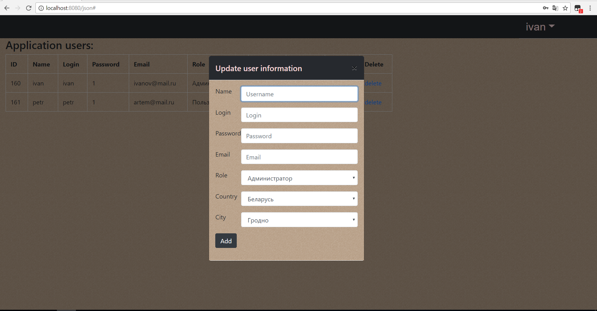

# job4j.ru Java course repository.

## Chapter 001. Basic syntax (Базовый синтаксис).

+ ##### 1. Data types (Типы данных).

    + [1.1. Basic calculator (Элементарный калькулятор)](./chapter_001/src/main/java/ru/job4j/calculator/Calculator.java)

+ ##### 2. Conditional (Условный оператор).

    + [2.1. Dummy bot (Глупый бот)](./chapter_001/src/main/java/ru/job4j/condition/bot/DummyBot.java)
    + [2.2. Find max from two (three) numbers (Найти максимум из 2 (3) чисел)](./chapter_001/src/main/java/ru/job4j/condition/max/Max.java)
    + [2.3. Triangle square calculation (Вычисление площади треугольника)](./chapter_001/src/main/java/ru/job4j/condition/triangle/Triangle.java) 

+ ##### 3. Cycles (Циклы).

    + [3.1. Count sum of even numbers in specific range (Подсчет суммы четных чисел в диапозоне)](./chapter_001/src/main/java/ru/job4j/loop/EvenCounter.java)
    + [3.2. Factorial (Факториал числа)](./chapter_001/src/main/java/ru/job4j/loop/Factorial.java)
    + [3.3. Chess desk in pseudographic (Шахмотная доска в псевдографике)](./chapter_001/src/main/java/ru/job4j/loop/ChessBoardPaint.java) 
    + [3.4. Pyramid in pseudographic (Пирамида в псевдографике)](./chapter_001/src/main/java/ru/job4j/loop/PiramidPaint.java) 
    
+ ##### 4. Arrays.

    + [4.1. Remove duplicates from array (Удаление дубликатов в массиве)](./chapter_001/src/main/java/ru/job4j/array/ArrayDuplicate.java)
    + [4.2. Array sorting (Сортировка массива перестановкой)](./chapter_001/src/main/java/ru/job4j/array/BubbleSort.java)
    + [4.3. Flip a one-dimensional array (Переворот одномерного массива)](./chapter_001/src/main/java/ru/job4j/array/Turn.java)
    + [4.4. Flip a two-dimensional array (Переворот двумерного массива)](./chapter_001/src/main/java/ru/job4j/array/RotateArray.java)

+ ##### 5. Basic syntax chapter final test (Контрольное задание по теме базового синтаксиса).

    + [5.1. Find substring in string without using String class methods (Содержание подстроки в строке (без использования методов класса String))](./chapter_001/src/main/java/ru/job4j/tests/StringContain.java)

## Chapter 002. OOP (Объектно-ориентированное программирование).

+ ##### 1. Chapter 002 tasks (Задачи части 002).

    + [1.1. Tracker - console application for accounting applications (Tracker - консольное приложение для учета заявок)](./chapter_002/src/main/java/ru/job4j/tracker)
    + [1.2. Strategy pattern (pseudographic) (Шаблон проектирования - стратегия (псевдографика))](./chapter_002/src/main/java/ru/job4j/pseudo)

+ ##### 2. OOP chapter final test (Контрольные задания по теме ООП).

    + [2.1. Chess API basing on one figure (API шахматной игры на примере одной фигуры)](./chapter_002/src/main/java/ru/job4j/chess)
    + [2.2. Vending machine API (API автомата по выдаче сдачи)](./chapter_002/src/main/java/ru/job4j/machine)

## Chapter 003. Collection framework (lite).

+ ##### 1. Задачи части 003.

    + [1.1. Преобразование двумерного массива в коллекцию](./chapter_003/src/main/java/ru/job4j/convert/ConvertList.java)
    + [1.2. Преобразование коллекции в двумерный массив с заданным количеством строк](./chapter_003/src/main/java/ru/job4j/convert/ConvertList.java)
    + [1.3. Преобразование коллекции массивов в коллекцию элементов](./chapter_003/src/main/java/ru/job4j/convert/ConvertList.java)
    + [1.4. Преобразование коллекции типа List в Map](./chapter_003/src/main/java/ru/job4j/convert/UserConvert.java)
    + [1.5. Сортировка объектов с использованием Comparator](./chapter_003/src/main/java/ru/job4j/sort/UserSort.java)
    + [1.6. Оценка производительности добавления, удаления элементов из коллекций](./chapter_003/src/main/java/ru/job4j/perfomance/Perfomance.java)

+ ##### 2. Контрольные задания по теме Collection (lite).

    + [2.1. Банковские переводы](./chapter_003/src/main/java/ru/job4j/bank/BankService.java)
    + [2.2. Сортировка подразделений](./chapter_003/src/main/java/ru/job4j/department/DepartmentSort.java)

## Chapter 004. Collection framework (pro).

+ ##### 1. Итератор.

    + [1.1. Итератор двумерного массива int[][]](./chapter_004/src/main/java/ru/job4j/iterator/ArrayIterator.java)
    + [1.2. Итератор четных чисел](./chapter_004/src/main/java/ru/job4j/iterator/EvenIterator.java)
    + [1.3. Итератор простых чисел](./chapter_004/src/main/java/ru/job4j/iterator/PrimeIterator.java)
    + [1.4. Преобразование итератора итераторов](./chapter_004/src/main/java/ru/job4j/iterator/ComplexIter.java)

+ ##### 2. Обобщение (generic).

    + [2.1. Создать параметризованный контейнер](./chapter_004/src/main/java/ru/job4j/generic/SimpleArray.java)
    + [2.1. Реализовать Store (User, Role) на базе контейнера из задания 2.1.](./chapter_004/src/main/java/ru/job4j/generic/service/BaseStore.java)

+ ##### 3. List interface.

    + [3.1. Создать динамический список на базе массива](./chapter_004/src/main/java/ru/job4j/list/ArrayContainer.java)
    + [3.2. Создать контейнер на базе связного списка](./chapter_004/src/main/java/ru/job4j/list/LinkedContainer.java)
    + [3.3. Создать контейнер типа Stack](./chapter_004/src/main/java/ru/job4j/list/StackContainer.java)
    + [3.4. Создать контейнер типа Queue](./chapter_004/src/main/java/ru/job4j/list/QueueContainer.java)
    + [3.5. Задан связный список, необходимо определить цикличность](./chapter_004/src/main/java/ru/job4j/list/CycleCheck.java)

+ ##### 4. Set interface.

    + [4.1. Реализовать Set на базе массива](./chapter_004/src/main/java/ru/job4j/set/SetContainer.java)
    + [4.2. Реализовать Set на базе связного списка](./chapter_004/src/main/java/ru/job4j/set/LinkedSetContainer.java)
    + [4.3. Реализовать Set на базе хэш-таблицы](./chapter_004/src/main/java/ru/job4j/set/HashSetContainer.java)

+ ##### 5. Map interface.

    + [5.1. Реализовать собственную HashMap](./chapter_004/src/main/java/ru/job4j/map/HashMapContainer.java)

+ ##### 6. Tree.

    + [6.1. Реализовать элементарную структуру дерева](./chapter_004/src/main/java/ru/job4j/tree/Tree.java)
    + [6.2. Реализовать бинарное дерево поиска](./chapter_004/src/main/java/ru/job4j/tree/BinaryTree.java)
   

+ ##### 7. Контрольные задания по теме Collection (lite).

    + [7.1. Биржевой стакан](./chapter_004/src/main/java/ru/job4j/test/exchange/ExchangeGlass.java)
    + [7.2. Лягушка](./chapter_004/src/main/java/ru/job4j/test/Frog.java)
    + [7.3. Посимвольное сравнение строк](./chapter_004/src/main/java/ru/job4j/test/WordCheck.java)

## Chapter 005. Многопоточность.

+ ##### 1. Задачи части 005.

    + [1.1. Реализовать потокобезопасный счетчик](./chapter_005/src/main/java/ru/job4j/counter/Count.java)
    см. также [Собственный механизм блокировок](./chapter_005/src/main/java/ru/job4j/counter/MyLock.java)
    + [1.2. Реализовать многопоточный счетчик слов и пробелов](./chapter_005/src/main/java/ru/job4j/thread/WordSpacesCounter.java)
    + [1.3. Реализовать механизм программной остановки потоков](./chapter_005/src/main/java/ru/job4j/thread/Interrupt.java)
    + [1.4. Реализовать потокобезопасный динамический контейнер](./chapter_005/src/main/java/ru/job4j/storage)
    + [1.5. Реализовать шаблон Producer-Consumer](./chapter_005/src/main/java/ru/job4j/monitore/Store.java)
    + [1.6. Реализовать ThreadPool](./chapter_005/src/main/java/ru/job4j/monitore/ThreadPool.java)
    + [1.7. Многопоточный поиск текста в файле](./chapter_005/src/main/java/ru/job4j/monitore/TextSearch.java)
    + [1.8. Реализовать неблокирующий кеш](./chapter_005/src/main/java/ru/job4j/nonblocking)

+ ##### 2. Контрольные задания по теме Многопоточность.

    + [2.1. API игры бомбермен](./chapter_005/src/main/java/ru/job4j/test)
    + [2.2. Эмулятор лифта](./chapter_005/src/main/java/ru/job4j/elevator)

## Chapter 006. SQL, JDBC.

+ ##### 1. Задачи части 006.

    + [1.1. XML XSLT JDBC Оптимизация](./chapter_006/src/main/java/ru/job4j/jdbc)

+ ##### 2. Контрольные задания по теме SQL, JDBC.

    + [2.1. Парсер вакансий sql.ru](./chapter_006/src/main/java/ru/job4j/test)

## Chapter 007. Servlet.

+ ##### 1. Задачи части 007.
    + [1.1. Реализовать приложения для работы с пользователем](./chapter_007/src/main/java/ru/job4j/crud)

    
    
    
